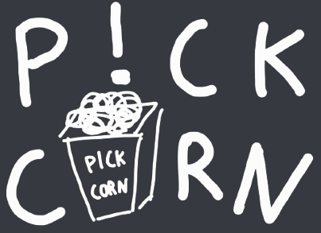

# 👩‍💻 관통 프로젝트 👨‍💻

👼 팀장 : 진지연

👶 팀원 : 심해영, 육승준

## 개요

> `01.` 팀 소개
>
> `02.` 목표
>
> `03.` 프로젝트 구조
>
> `04.` 기능 설명
>
> `05.` 추천 알고리즘 상세 설명
>
> `06.` 

## 01. 팀 소개

#### 🍟 팀 명 : Pickcorn

* 영화를 골라서 추천해준다는 뜻의 `Pick` 과 영화 필수템 `Popcorn` 을 합쳐서 만들었습니다.

#### 🍟 팀원 소개

🍊 진지연 (팀장)

	* 영화 추천 알고리즘 구현
	* movies 앱 > index 구현
	* 관리자뷰 생성
	* ajax / 배포

🍍 심해영

* accounts 앱 > 회원가입 / 로그인 / 로그아웃 구현
* navbar / font / css / 기타 레이아웃 구현
* review 생성, 수정, 디테일,  mypage 레이아웃 구현

🥑 육승준

* movies 앱 > detail / community 구현
* user profile / followers / followings 구현
* 영화 제목 & user id 검색 기능 구현
* 사용자 평점 시스템

---

## 02. 목표

---

## 03. 프로젝트 구조

| pickcorn/                                                    | accounts/                                                    | movies/                                                      |
| ------------------------------------------------------------ | :----------------------------------------------------------- | ------------------------------------------------------------ |
| static/         base.css         pickcorn.jpg         pickcorn2.jpg         pickcorn3.jpg     templates/         base.html     setttings.py     urls.py | migrations/     static/         login.css         profile.css         signup.css         signupload.css     templates/         accounts/             followers.html             followings.html             login.html             profile.html             signup.html             signupload.html     forms.py     models.py     urls.py     views.py | fixtures/     migrations/     static/         article_create.css         article_detail.css         article_update.css         detail.css         index.css         pickcorn3.png     templates/         movies/             article_create.html             article_detail.html             article_update.html             detail.html             homepage.html             index.html             searchpage.html     forms.py     models.py     serializers.py     urls.py     views.py |

---

## 04. 기능 설명

### 1. 회원가입

#### 🎈 1. 회원가입 하기

   

#### 🎈 2. 회원가입 중 오류가 발생하면 해당 오류 원인을 알려줍니다.

   

#### 🎈 3. 회원가입 완료 후 안내 페이지

 

---

### 02. 로그인

#### 🎈 1. 로그인 하기

   

#### 🎈 2. 로그인 중 오류가 발생하면 해당 오류 원인을 알려줍니다.

   

---

### 03. 메인 화면

#### 🎈 1. 회원가입 / 로그인 하기 전

* navbar : pickcorn 로고, sign in, login
* 상단에 회원가입을 유도하는 메세지
* 영화 추천 서비스를 받을 수 없음

#### 🎈 2. 회원가입 / 로그인 후

* navbar : pickcorn 로고
  * Home : 메인 화면
  * Search : 검색 기능
  * Mypage

#### 🎈 3. 플레이 리스트에 추가한 영화와 비슷한 영화를 추천받을 수 있음

* 예를들어 디즈니의 `주토피아` 라는 영화를 좋아요 누른다면

  

  

* 메인 화면에서 비슷한 영화가 추천 목록에 뜨게 됨

    👉 

#### 🎈 4. 팔로우 한 유저의 영화 목록을 추천받을 수 있음

* `search` 를 통해 유저 검색 후 `follow` 클릭

     👉  👉 

   

* 메인 화면에서 follow 한 유저의 영화 목록이 뜸

  

#### 🎈 5. 메인 화면 기타 컨텐츠

* 순위 TOP 20 영화

  

* 조회수가 높은 영화

  

* Try New 랜덤 영화 추천

  

---

### 04. 영화 Detail 화면

#### 🎈 1. Detail 페이지

* add to my list : 내가 찜한 콘텐츠에 추가

#### 🎈 2. 좋아요 기능

* 유저들의 좋아요 퍼센트가 반영됨

#### 🎈 3. 싫어요 기능

* 유저들의 싫어요 퍼센트가 반영됨

* 여러 유저들이 좋아요 / 싫어요 투표를 했을 경우

#### 🎈 4. 리뷰 생성 & 수정

 👉 

* 리뷰가 늘어나면 pagenation 기능으로 다음 페이지를 볼 수 있음

  👉  

#### 🎈 5. 리뷰 Detail 페이지

#### 🎈 6. 리뷰 Detail 페이지 댓글 생성

---

### 05. MyPage

#### 🎈 1. MyPage 메인

* Bootstrap5 > Accordion 기능으로 구현 

#### 🎈 2. 작성한 리뷰

* 클릭 시 유저가 작성한 리뷰 Detail 페이지로 이동

#### 🎈 

#### 🎈 

#### 🎈 

