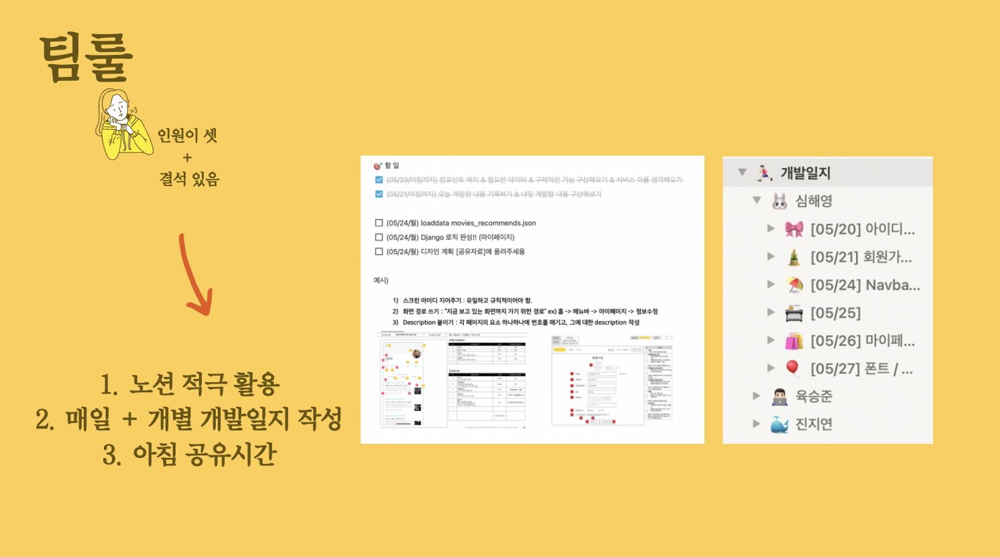
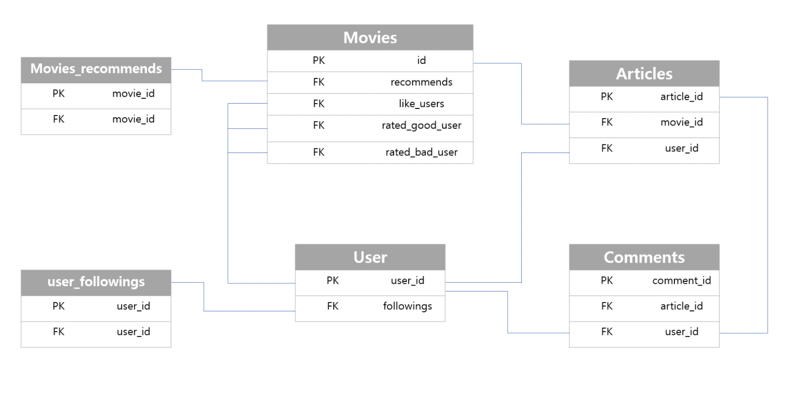
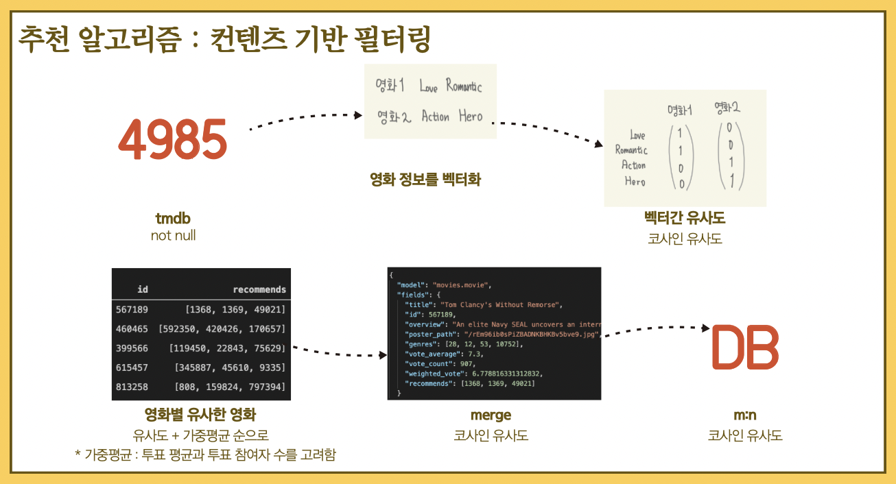
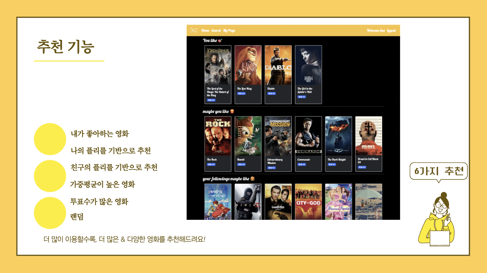
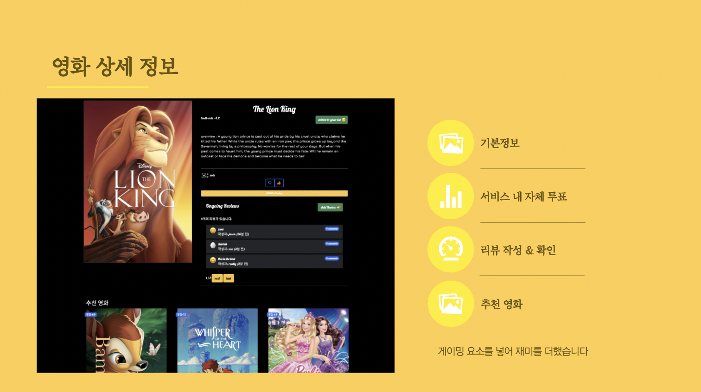
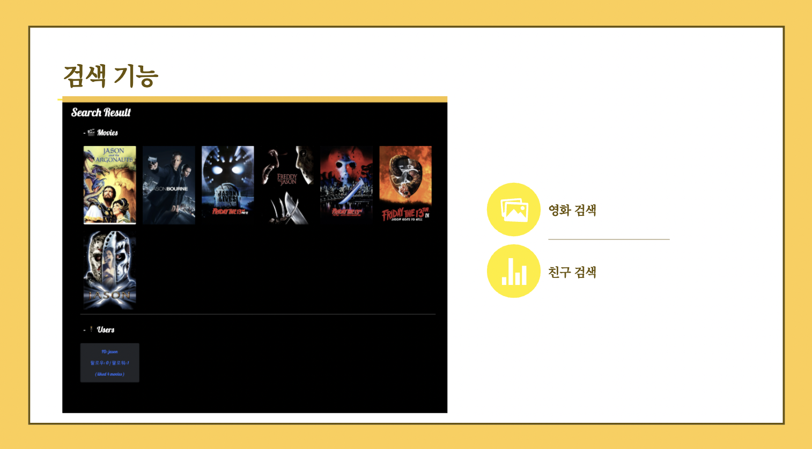
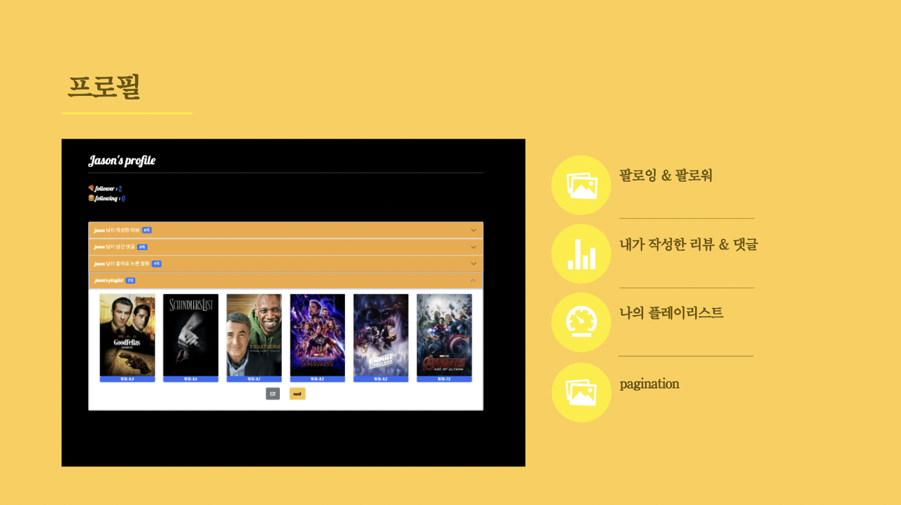
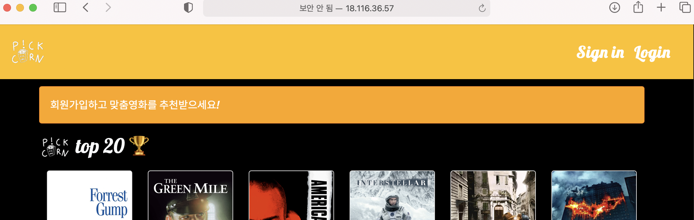

# 👩‍💻 관통 프로젝트 👨‍💻

### SSAFY 우수 프로젝트 선정

👼 팀장 : 진지연

👶 팀원 : 심해영, 육승준


## 01. 목적

자체적인 추천 알고리즘을 구현하고

기본기능을 완비한 서비스를 개발하자


## 02. 팀 소개

🍟 팀원 및 역할 분배

🍊 진지연 (팀장)

	* 영화 추천 알고리즘 구현
	* movies 앱 > index 구현
	* ajax / 배포

🍍 심해영

* accounts 앱 > 회원가입 / 로그인 / 로그아웃 구현
* navbar / font / css / 기타 레이아웃 구현
* review 생성, 수정, 디테일,  mypage 레이아웃 구현


🥑 육승준

* movies 앱 > detail / community 구현
* accounts 앱 > profile / followers / followings 구현
* 영화 제목 & user id 검색 기능 구현




## 03. 데이터베이스 모델링(ERD)




## 04. 추천 알고리즘

db & recommend.ipynb 참조




api를  활용하여 tmdb에서 5000개의 데이터를 불러오고, 이 중에 poster_path가 null값이 아닌 데이터를 저장한다. 

#### 🌵 장르를 기준으로 영화 정보를 벡터로 만든다

```
movies_df['genres_literal'] = movies_df['genres'].apply(lambda x : (' ').join(map(str, x)))
count_vect = CountVectorizer(min_df=0, ngram_range=(1,2))
genre_mat = count_vect.fit_transform(movies_df['genres_literal'])
```

#### 🌵 코사인 각도를 기준으로 벡터 간 유사도 구한다

```
genre_sim = cosine_similarity(genre_mat, genre_mat)
genre_sim_sorted_ind = genre_sim.argsort()[:, ::-1]
```

영화 별로 유사도 순으로 6개 영화를 추출하고, 이 중 가중평균이 높은 3개를 추출한다. 가중평균은 평균 평점에 투표수를 가중치로 둔 점수이다. 영화별 추천 영화 테이블을 기존의 영화정보 테이블에 merge한 후, M:N 관계로 DB에 저장한다. 이 추천 알고리즘을 기반으로 총 6가지 추천 테마를 제시한다.




## 05. 기능







- 세션ID를 활용한 로그인
- 리뷰 CRUD
- 댓글 CRD
- 자세한 기능은 video.mp4로 살펴보실 수 있습니다


## 06. 배포

AWS 서버를 활용한 배포 (현재는 접속 불가)

